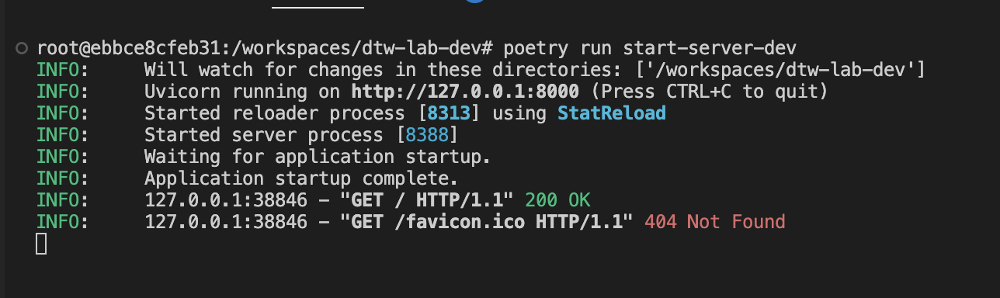
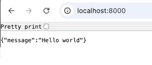
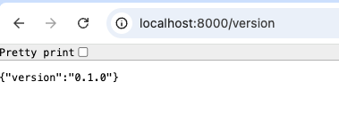
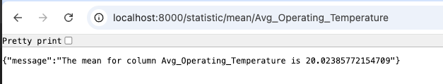
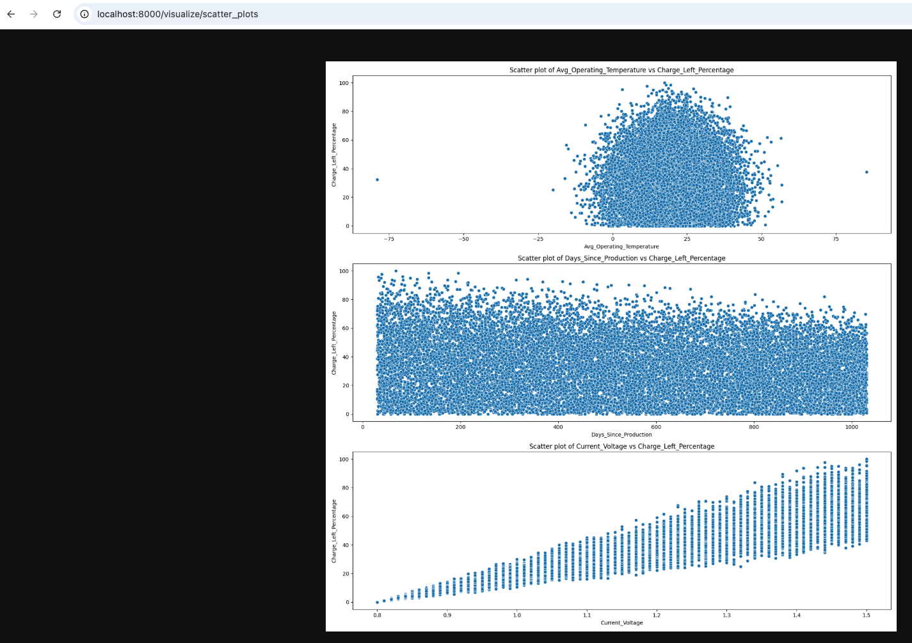

# Making our code accessible through APIs

## Understanding APIs

Right now our code is only accessible if we download it and run the main.py file. This has several limitations:

1. Users need to have Python installed on their machine
2. They need to download and manage all the dependencies
3. If we release a new software version, they need to update their software as well.
4. Each user needs their own copy of the code and data

To solve these limitations, we can create an API (Application Programming Interface) for our code. An API acts as a bridge that allows different software applications to communicate with each other. By creating an API, the benefits we can gain include:

1. Make our code accessible over the internet.
2. Allow other applications to use our functionality without needing to understand the implementation. Just like when you order Pizza at a restaurant, you do not care about the implementation details, you just care about receiving your Pizza.
3. Control access and usage of our application

## Hello World of APIs

We will use FastAPI to expose our application.

Create a file called _lab2.py_ in the same directory as _lab1.py_ and add the following code:

```python
import uvicorn
from fastapi import FastAPI
from fastapi.responses import FileResponse
from pathlib import Path
import toml
from dtw_lab.lab1 import (
    read_csv_from_google_drive,
    visualize_data,
    calculate_statistic,
    clean_data,
)

# Initialize FastAPI application instance
# This creates our main application object that will handle all routing and middleware
app = FastAPI()

# Server deployment configuration function. We specify on what port we serve, and what IPs we listen to.
def run_server(port: int = 80, reload: bool = False, host: str = "127.0.0.1"):
    uvicorn.run("dtw_lab.lab2:app", port=port, reload=reload, host=host)

# Wrapper functions for script entry points
def run_server_dev():
    """Development server with hot reload on port 8000"""
    run_server(port=8000, reload=True)

def run_server_prod():
    """Production server on all interfaces"""
    run_server(reload=False, host='0.0.0.0')

# Define an entry point to our application.
@app.get("/")
def main_route():
    return {"message": "Hello world"}
```

This is the hello world of APIs. It creates a FastAPI instance called app, defines a function run_server that uses uvicorn to start the web server. Finally, it includes a single route handler for the root path ("/") that responds to GET requests by returning a simple JSON message "Hello world". When run, this creates a minimal web API that you can access through a web browser or API client.

To run this, let's add some scripts to our pyproject.toml file so that we can directly run the server using uv.

```toml
[project.scripts]
start-server-dev = "dtw_lab.lab2:run_server_dev"
start-server = "dtw_lab.lab2:run_server_prod"
```

Note that we have created two entry points:

1. **start-server-dev**: This is a development server configuration that runs on port 8000 with hot reloading enabled (reload=True), meaning the server will automatically restart when code changes are detected. This is ideal for local development.

2. **start-server**: This is a production server configuration that runs with reloading disabled (reload=False) and is set to listen on all network interfaces. This configuration is suitable for production deployment where you want the server to be accessible from external network connections.

These entry points can be executed using:

```bash
uv run start-server-dev
```

or

```bash
uv run start-server
```

respectively.

> [!NOTE]
> Alternatively, you can run the server directly using `uv run python -m dtw_lab.lab2` after modifying the code to accept command-line arguments, or by activating the virtual environment with `source .venv/bin/activate` and then running Python directly.

Start the dev server as shown in figure _Starting the server_, and check that you can access the API through your localhost on port 8000 as shown in figure _Accessing the API_



_Figure: Starting the server_



_Figure: Accessing the API_

## Exposing our functions through APIs

Now, it is your turn. In the _lab2.py_ file, create the following routes and complete them.

```python
@app.get("/statistic/{measure}/{column}")
def get_statistic(measure: str, column: str):
    # Read the CSV data, clean the data, and calculate the statistic.

@app.get("/visualize/{graph_type}")
def get_visualization(graph_type: str):
    # Read the CSV data, clean the data, and visualize it.
    # This should create 3 files in the graphs folder.
    # Based on the graph_type input, return the corresponding image
    # HINT: Use FileResponse

@app.get("/version")
def get_visualization_version():
    # Using the toml library, get the version field from the "pyproject.toml" file and return it.
```

When you implement them and run the dev server again, you can call the APIs from your browser and should see results similar to the ones shown in figures _Version API_, _Statistics API_ and _Visualize API_



_Figure: Version API_



_Figure: Statistics API_



_Figure: Visualize API_

---

[← Back to Main README](README.md) | [Next: Unit Tests →](02-unit-tests.md)

