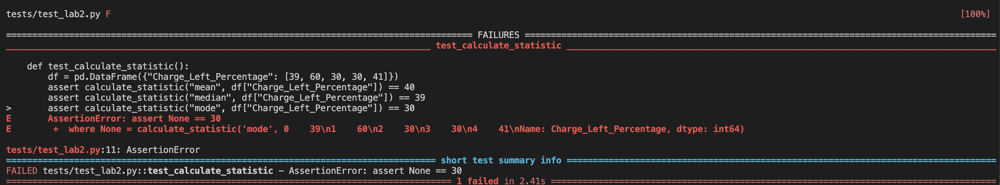
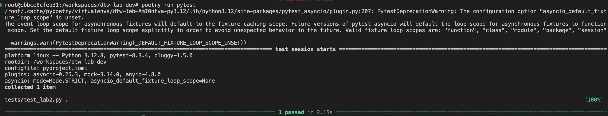
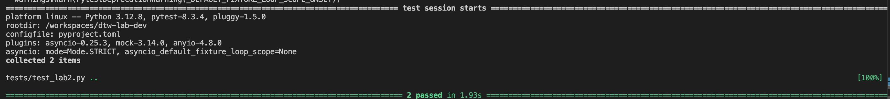

# Unit tests

In lab 1 we finished with the open ended question: How does the approver of the PR know that the new code works as expected?

The answer: tests.

Tests in software development are quality checks that help developers ensure their code works correctly. Think of them as a series of automated experiments that verify if different parts of a program behave as intended. Developers write tests to check if their code produces the expected results. For example, if you have a function that adds two numbers, a test would verify that 2 + 2 actually equals 4 when run through that function. Tests help catch bugs early, make it safer to make changes to the code, and serve as documentation for how the software should work. They can range from simple checks of individual functions (unit tests) to complex scenarios that test entire systems working together (end to end tests). When a developer makes changes to the code, they can quickly run these tests to make sure they haven't accidentally broken anything that was working before.

## Writing our first test

In lab 1, we did not write a single test. When a colleague ran a PR, we would have to clone and manually test the software to check it still works. In this section, we will start writing unit tests to add coverage to our code.

We will start testing the calculate_statistic function. Create a file in the _tests_ folder and name it _test_lab2.py_ and add:

```python
from src.dtw_lab.lab2 import get_statistic
import pandas as pd
import pytest
from dtw_lab.lab1 import calculate_statistic

def test_calculate_statistic():
    df = pd.DataFrame({"Charge_Left_Percentage": [39, 60, 30, 30, 41]})
    assert calculate_statistic("mean", df["Charge_Left_Percentage"]) == 40
    assert calculate_statistic("median", df["Charge_Left_Percentage"]) == 39
    assert calculate_statistic("mode", df["Charge_Left_Percentage"]) == 30
```

This test uses pytest to verify the calculate_statistic function by creating a test DataFrame with battery charge percentages and asserting that the mean (40), median (39), and mode (30) calculations are correct for the given data. To run the test, you can simply execute pytest in the terminal from your projects root directory - pytest will automatically discover and run any Python files that start with test_ and any functions within those files that start with test_.

Execute pytest using `uv run pytest`. You should see something like in figure _Failing unit test_. It is showing us that one of our assertions is not true. Hence, we have found a bug in our code. Fix it and run pytest again. Now, you should see a passing test as shown in figure _Passing unit test_.



_Figure: Failing unit test_



_Figure: Passing unit test_

## Implementing unit tests for encode_categorical_vars

Now, write your own test for the function encode_categorical_vars and make sure you have two passing tests as shown in figure _Added a second test for encode_categorical_vars_



_Figure: Added a second test for encode_categorical_vars_

## Understanding Mocks

Notice we create a DataFrame in the first test case, instead of using read_csv_from_google_drive. This follows a key testing best practice: avoiding external dependencies and network calls in unit tests. This approach is better because:

1. Unit tests should be fast and reliable (network calls are slow and can fail)
2. Unit tests should be deterministic (external data could change)
3. Unit tests should work offline
4. We have full control over the test data and can design edge cases
5. We will not negatively impact third party dependencies with our failing code.

When functions use external dependencies or network calls, we need to "mock" or "stub" external dependencies. Mocks are objects that simulate the behavior of real dependencies (like databases, APIs, or complex objects) in unit tests. They allow you to replace real dependencies with fake versions that can return predetermined responses. Take the following example:

```python
def test_api_call(mocker):
    # Setup the mock
    mock_get = mocker.patch('mymodule.requests.get')
    mock_get.return_value.json.return_value = {'data': 'fake_response'}

    # Run the function
    result = my_function_that_calls_api()

    # Assertions
    assert result == 'fake_response'
    assert mock_get.called
    mock_get.assert_called_once() # Can use more specific assertions
```

This test case uses pytest and pytest-mock to verify a function that makes an API call, but without actually making the network request. It creates a mock (fake) version of the requests.get method that returns a predefined response {'data': 'fake_response'}, then calls the function under test (my_function_that_calls_api()), and finally verifies three things: that the function returns the expected fake response, that the mock API call was actually made, and that it was called exactly once.

## Writing a unit test with mocks

If you implemented the _get_statistic_ function correctly in section "Exposing our functions through APIs", it should be using the _read_csv_from_google_drive_ function. Write a test for the _get_statistic_ function, and remember to mock out external dependencies.

---

[← Back to Main README](README.md) | [Previous: Creating APIs](01-creating-apis.md) | [Next: Dockerizing →](03-dockerizing.md)

