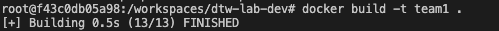
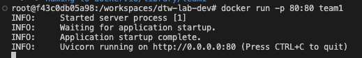

# Dockerizing our application

Now, thanks to unit tests, we have working code in our repository. We need to package it so that it is easy to deploy to production in the next steps.

Docker containerization is a powerful option for packaging applications. With Docker, you create a Dockerfile that specifies your application's environment, dependencies, and runtime configuration. This ensures your application runs consistently across different systems and makes deployment much simpler. Later on, we will see how easy it is to deploy our application. Docker containers are self-contained units that include everything needed to run your application, making them excellent for [microservices](https://martinfowler.com/articles/microservices.html#CharacteristicsOfAMicroserviceArchitecture) architecture or applications with complex dependencies.

The ability to launch stateless instances of your application helps to improve scalability, consistency and deployment flexibility.

Consider a scenario where your application crashes. With Docker, you can spawn up a new container from a pre-created image and guarantee that it will behave as the previous one.

Now consider that you have to handle thousands of concurrent requests. You can launch more Docker containers to split the load between them. These are just a few of the use cases of containers.

We will now Dockerize our Application. At the root level of your directory, add a Docker file that runs all the necessary steps we have needed to make our application run.

Avoid adding unnecessary dependencies (for example, we won't need to install Docker inside Docker in this case).

Your Dockerfile should start with

```bash
FROM python:3.12
```

As an end result, you should be able to execute the following commands:

```bash
docker build -t team${ADD_YOUR_TEAM_NUMBER_HERE} . # Build your container
docker run -p 80:80 team${ADD_YOUR_TEAM_NUMBER_HERE} # Run your container and make it accessible through port 80.
```

and see the results shown in figures _Build Docker image_ and _Run the docker image_



_Figure: Build Docker image_



_Figure: Run the docker image_

**Tip:** to test commands interactively, instead of blindly adding them in the Dockerfile and trusting they will work, you can launch an interactive session to your Docker container by building an image with the layers you know that work and running:

```bash
docker run -it --rm --entrypoint /bin/bash team${ADD_YOUR_TEAM_NUMBER_HERE}
```

---

[← Back to Main README](README.md) | [Previous: Unit Tests](02-unit-tests.md) | [Next: CICD Pipelines →](04-cicd-pipelines.md)

