# Creating the Pipelines

We have exposed our app through an API, written unit tests and dockerized it. We will now create the CICD pipelines that orchestrate the process to reach production safely.

We will do this using GitHub Actions. In GitHub Actions, you create workflow files using YAML syntax, which are stored in the .github/workflows directory of your repository. These YAML files define the entire automation process, including when the workflow should run, what environment it needs, and the specific steps it should execute. Each workflow file can contain one or more jobs that can run sequentially or in parallel, and each job consists of individual steps that perform specific tasks.

In our case, we will create two workflows. One that gets triggered with pull requests, and one that is triggered on merge requests.

On pull requests, we will have the workflow shown in figure _GitHub actions PR Pipeline_.

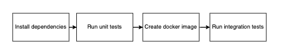

_Figure: GitHub actions PR Pipeline_

It will:

1. Install dependencies: install things like uv, Python and Docker in the GitHub Actions runner.
2. Run the unit tests that we defined.
3. Build a docker image.
4. Based on the built Docker image: run integration tests. These check that our Docker container works as expected. Instead of going as deep into the code as unit tests, here we treat the Docker image as a black box and check that it responds appropriately.

This will give Pull Request reviewers information on the status of our code, and if it passes tests and builds as expected.

Once a PR is approved and merged, we want to actually deploy our API so that customers can use it. A second pipeline will do this following the steps shown in figure _GitHub actions Merge Pipeline_.

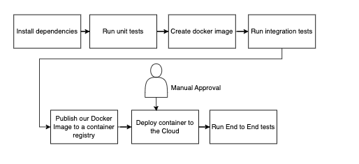

_Figure: GitHub actions Merge Pipeline_

It will:

1. Run the same steps as the PR request: we are just verifying again that our code is stable. More advanced pipelines were timing is critical would probably find a way to avoid this duplication of work.
2. Publish our image: we are storing it in a repository like DockerHub. In the same way that GitHub exists to store our code, Docker registries exist to store our docker images.
3. Deploy to the cloud: we will use the Cloud to deploy our docker image and make it available through the internet.
4. Run end to end tests: now that our application is actually on the cloud, we can check if it is publicly accessible and working as expected for our customers.

Note that this pipeline only deploys once. Typically, we would have different environments, with production being available to customers, staging being a stable copy of our environment, testing used by the quality assurance team and development being used for iterating on the functionality of our code. Check figure _We use different environments to check that our code changes were successful_ for a visual understanding.

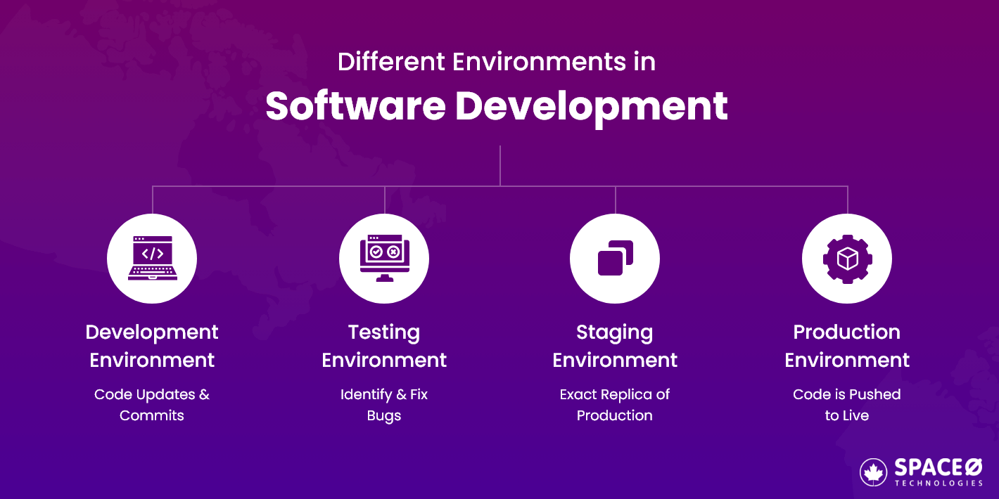

_Figure: We use different environments to check that our code changes were successful_

##  Creating an Environment and adding manual approvals

Lets add a manual step before deployment occurs, so we do not have unwanted/accidental deployments.

Go to settings->Environments and create an environment named development. Then, check the box "Require reviewers" and grant the appropriate users permissions to approve the deployment action as shown in figure _Protecting our environments through manual approval processes._.

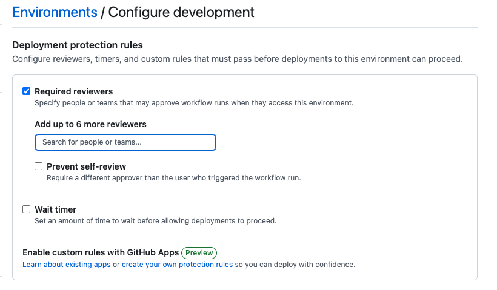

_Figure: Protecting our environments through manual approval processes._

## Configuring the environment with environment variables and secrets

To make our Docker image available in the Cloud or push it to a registry we need to add variables and secrets to our pipelines so that the GitHub runners have the correct credentials.

In the environment you created, go to Environment variables and add the variables shown in figure _Variables used by our pipelines_. Ask your professor to grant you a team number and use that.

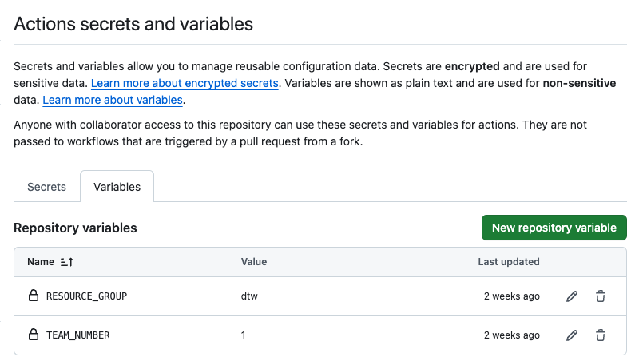

_Figure: Variables used by our pipelines_

Now go to the Environment secrets and add the secrets shown in figure _Secrets used by our pipelines_. Ask your professor to provide the actual secret values. As the name states, these are sensitive values. DO NOT SHARE THEM!

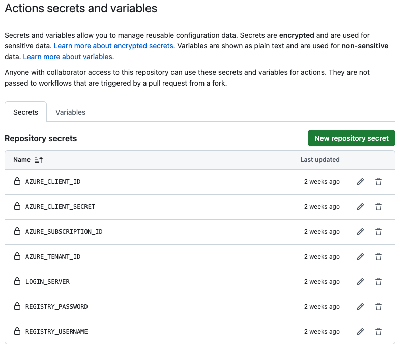

_Figure: Secrets used by our pipelines_


## Creating the pipeline that runs on PR

Now we will implement two pipelines using GitHub Actions. GitHub looks for files in the folder '.github/workflows' to create pipelines. In Moodle you will find a starting point for the pipelines.

Also from Moodle, get and add the folder 'scripts' and its content to the repository. This includes some helper scripts that will make the process of building, testing releasing and deploying simpler.

1. **build.sh**: This script is responsible for building a Docker image. It extracts the package version from the pyproject.toml file and builds a Docker image with the tag $LOGIN_SERVER/team$TEAM_NUMBER:$PACKAGE_VERSION to make the release easier. It also creates a latest tag for the same image.

2. **integration_test.sh**: This script performs integration testing on the built container. It extracts the package version from pyproject.toml to figure out the tag of the container that it can run. It runs the container locally on port 80 and waits for 20 seconds to allow the container to start. Finally, it sends a curl request to check if the container is running. This is a very simple test, but at least we know our container is able to spin up. Finally, it stops and removes the container.

3. **release.sh**: this script is responsible for releasing the built container. It extracts the package version from pyproject.toml and logs into the container registry using the Secrets we added to our repository. It pushes the built image to the registry and makes the package version available to the next step in a GitHub Actions workflow by writing it to the $GITHUB_OUTPUT file.

4. **deploy.sh**: This script handles the deployment of the container to Azure cloud. It logs into Azure using service principal credentials and creates a container in Azure Container Instances. This is the power of the cloud. With one single command, the container you created is available for anyone to consume. In fact, you should already see a running container in http://team{TEAM-NUMBER}.northeurope.azurecontainer.io/. Go ahead and check that you can access it.

Add all these files to your repository and execute the following command inside the scripts folder to allow them to be used as executables:

```bash
chmod +x *
```

Create a feature branch for the changes, push, and open a PR. You do not need to modify the content of the files yet.

If we added the files correctly, the pipeline defined in the file pr-openning.yaml will be triggered as shown in figure _PR running the automatic checks_. These checks show up with the PR process to give more information to our code reviewer on the status of our code changes.

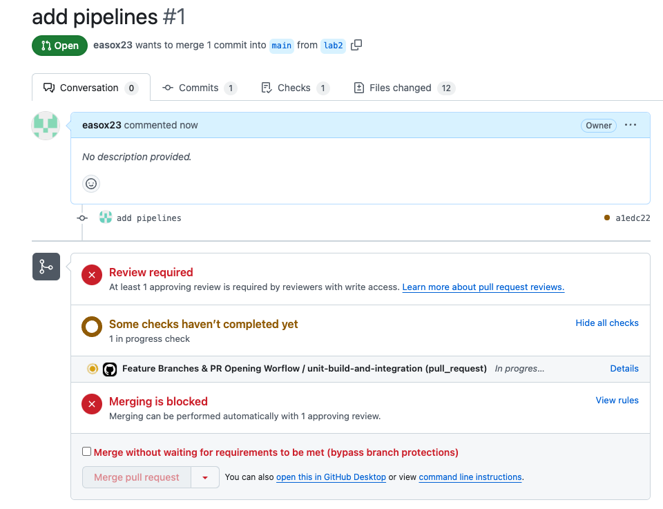

_Figure: PR running the automatic checks_

Inside the actions section of your repository, you can see what the actual pipeline is running. Figure _PR Pipeline Steps_ shows the steps.

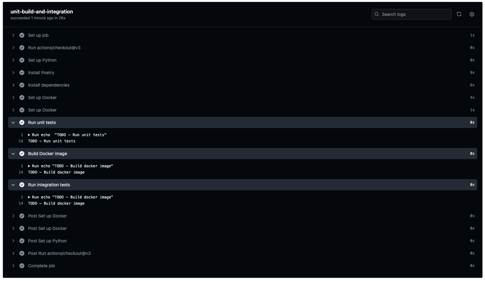

_Figure: PR Pipeline Steps_

### Adding functionality to the pipeline

Figure _PR Pipeline Steps_ shows the steps we described in the "Creating the Pipelines" section. We install dependencies (first 7 steps), we run unit tests, we build the docker image, and we run integration tests. Note however, that the tests and Docker steps are not yet implemented. You should now work to add them to the pipeline. Use the files in the scripts folder to help you.

**Tip:** you can run .sh files as a step in the pipeline. This simplifies debugging. You should not try to add all the bash code to the yaml file.

When setting up the GitHub Actions workflow, you'll need to install dependencies using uv. Here's an example of how to set up uv in your workflow:

```yaml
- uses: astral-sh/setup-uv@v3
  with:
    version: "latest"
- run: uv sync
- run: uv run pytest
```

## Creating the pipeline that runs on Merge to Main

Now we want to build the pipeline that runs once we merge to main. As described in the "Creating the Pipelines" section, it will repeat the steps from the PR pipeline, but add release, deployment and end to end test steps.

This pipeline should have 3 jobs.

1. **release**: Identical to previous pipeline with the addition of running release.sh as the last step. Release should take the Docker image we build and push it to a registry.

2. **deploy-to-dev**: This job should wait until release step is done. It will take the container image we just released and tell the cloud to run it. You can read more about the cloud service that will run it [here](https://azure.microsoft.com/en-us/products/container-instances). Make sure to tag it as a [development environment](https://docs.github.com/en/actions/writing-workflows/choosing-what-your-workflow-does/using-environments-for-deployment) so that the manual approval rule we defined before takes effect. Also, make sure to add the environment variables that the deploy.sh script needs.

3. **e2e-tests**: This is not yet implemented in the scripts file. With end to end tests, we want to test the real system that our users will see. You will need to write a script to see that your container is working. It should be accessible at http://team{TEAM-NUMBER}.northeurope.azurecontainer.io/

Note that each job runs on a brand new clean container. So for each job you will need to reinstall the needed dependencies using uv. Also note what environment variables the helper scripts need when you are defining your Github actions pipelines. Check the images from section "Deployment results" to guide you.

**Tip:** Change the trigger conditions for this pipeline to run on every commit so that you can test that it works without having to merge to main. When you are ready, change the condition back to only pushes to main.

## Deployment results

When your merge pipeline is working, any new changes that reach the main branch should automatically be made available in your public URL. The following figures show what you should observe.

Figure _Merge pipeline shown on GitHub_ shows the jobs of your pipeline, figure _Manual step before deployment_ shows the manual approval before deployment. Finally, if you deployed correctly, you should be able to access your container in a public link as shown in figure _Public access to my container_.

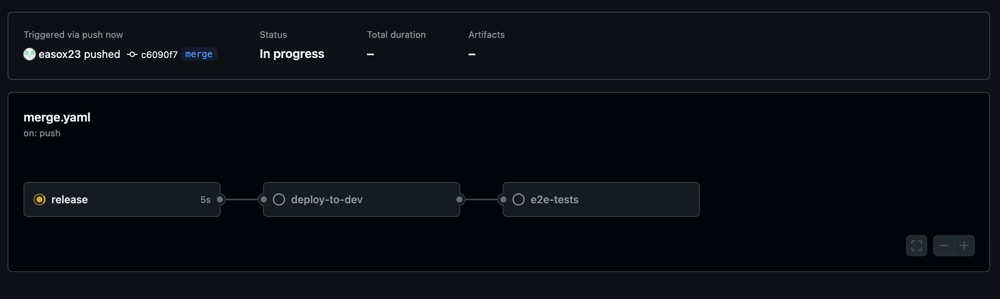

_Figure: Merge pipeline shown on GitHub_

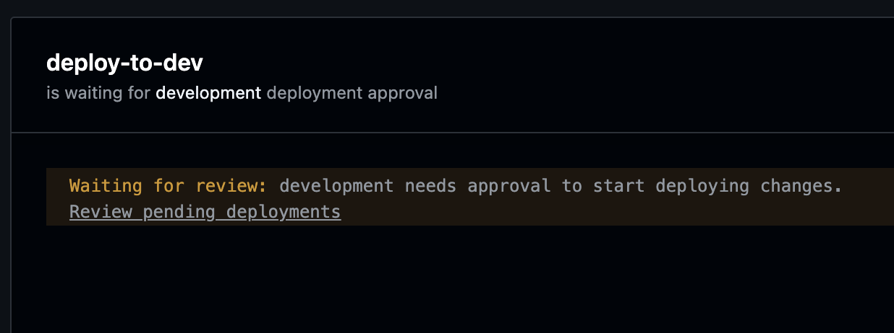

_Figure: Manual step before deployment_

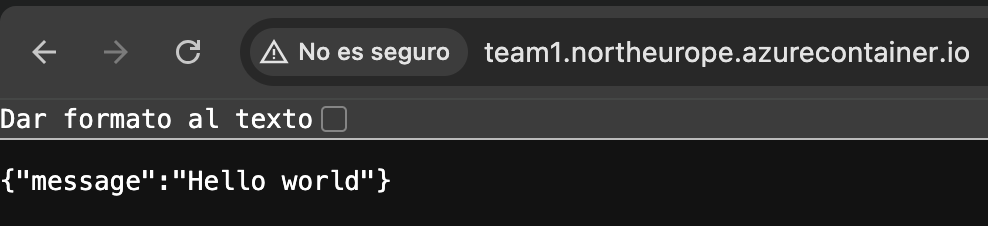

_Figure: Public access to my container_

---

[← Back to Main README](README.md) | [Previous: Dockerizing](03-dockerizing.md) | [Next: Conclusion →](05-conclusion.md)

